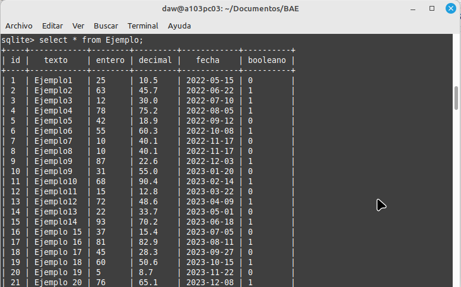
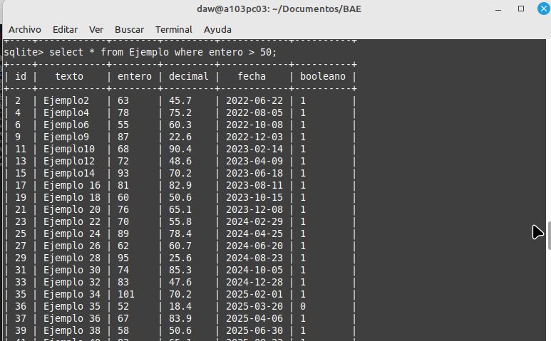
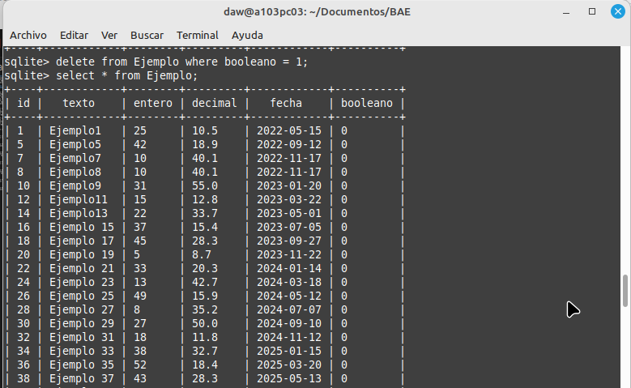
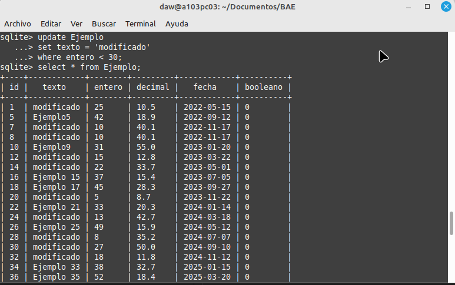
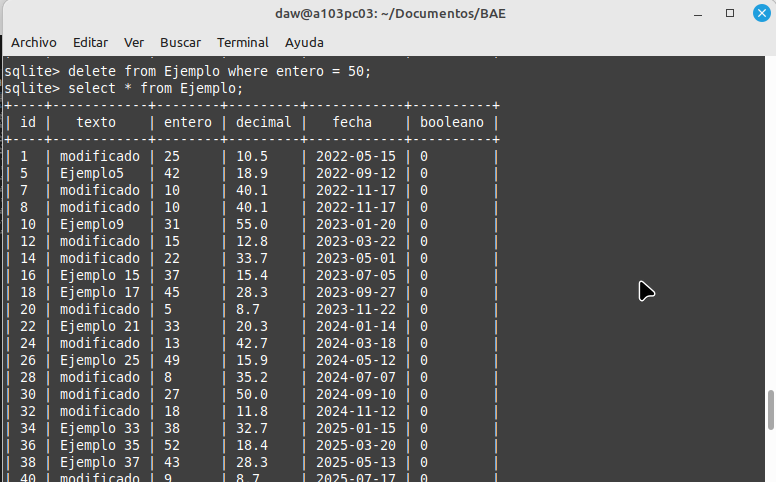
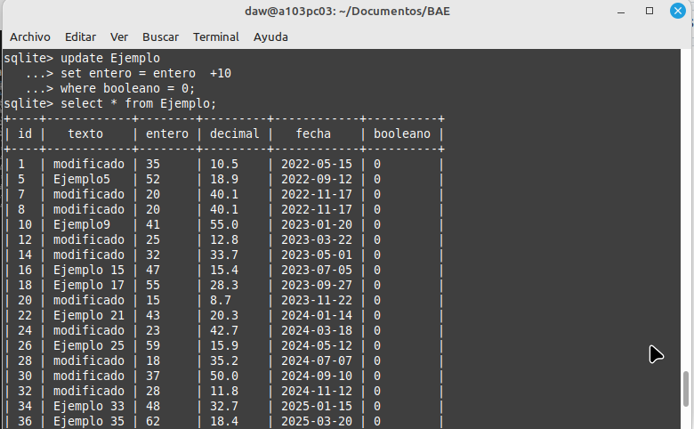
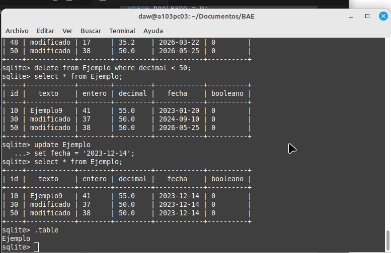
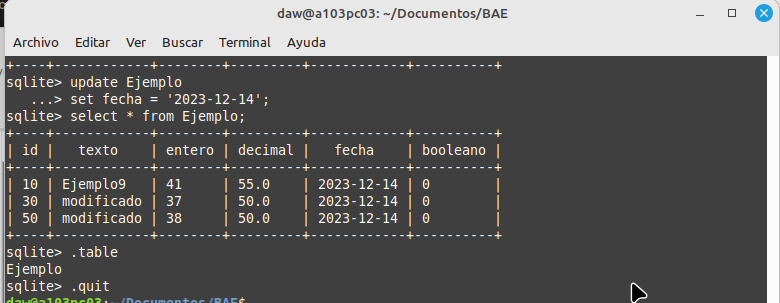

# Objetivo
Practicar la creación y manipulación de una base de datos SQLite3 desde la línea de comandos.

## Paso 1: Crear una tabla con un campo de cada tipo

Crear tabla con columnas id, texto, entero, decimal, fecha, booleano:

```sql
create table Ejemplo (
id integer not null primary key autoincrement,
texto text,
entero integer,
decimal real,
fecha date,
booleano boolean);
```
## Paso 2: Insertar 50 entradas

```sql
insert into ejemplo ( texto, entero, decimal, fecha, booleano)
values ('Ejemplo1', 25, 10.5, '2022-05-15', 0);
......
insert into Ejemplo (texto, entero, decimal, fecha, booleano)
values ('Ejemplo 50', 75, 85.3, '2026-06-11', 1);
```
## Paso 3: Realizar 5 consultas de datos

### Todas las entradas de la tabla Ejemplo

```sql
select * from Ejemplo;
```


### Todas las entradas con el campo entero mayor a 5

```sql
select * from Ejemplo where entero > 50;
```


## Paso 4: Realizar 3 eliminaciones y 3 modificaciones

### Eliminar las entradas donde el campo booleano es igual a True.

```sql
delete from Ejemplo where booleano = 1;
```


### Modificar el campo texto de las entradas donde el campo entero es menor a 30 y establecer el texto como "Modificado".

```sql
update Ejemplo
set texto = 'modificado' 
where entero < 30;
```


### Eliminar las entradas donde el campo entero es igual a 50.

```sql
delete from Ejemplo where entero = 50;
```



### Incrementar en 10 el valor del campo entero para las entradas donde el campo booleano es igual a False.

```sql
update Ejemplo
set entero = entero  +10
where booleano = 0;
```


### Eliminar las entradas donde el campo decimal es menor a 50.

```sql
delete from Ejemplo where decimal < 50;
```


### Actualizar el campo fecha de todas las entradas a la fecha actual.

```sql
update Ejemplo
set fecha = '2023-12-14';
```

