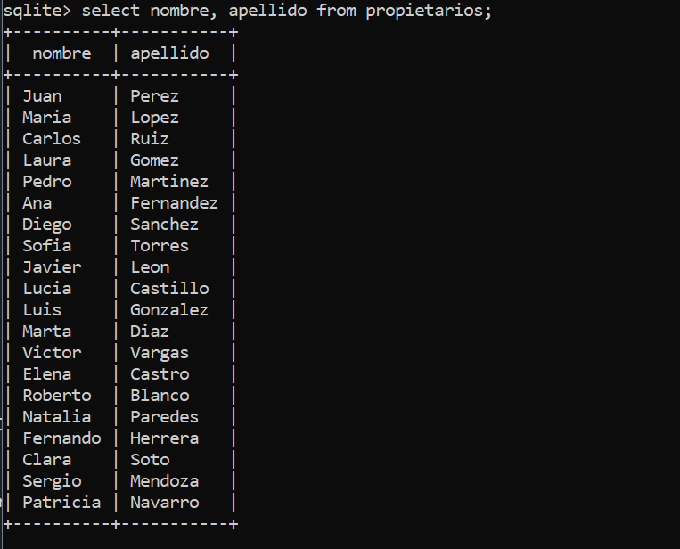

# Creación de la Base de Datos

## Objetivo

Practicar la creación y manipulación de una base de datos SQLite3 desde la línea de comandos.

## Paso 1

Crear una tabla con un campo de cada tipo

### Tabla "Propietarios"
```sql
create table propietarios(
	id integer primary key autoincrement,
	nombre text not null,
	apellido text not null,
	dni text not null unique
);
```
### Tabla "Vehiculos"
```sql
create table vehiculos(
	id integer primary key autoincrement,
	marca text not null,
	modelo text not null,
	anio text not null,
	id_prop integer not null,
	foreign key (id_prop) references propietario(id)
);
```


## Paso 2

Insertar 20 entradas

```sql
insert into propietarios(nombre, apellido, dni)
values('Juan', 'Perez', '12345678A');
insert into vehiculos(marca, modelo, anio, id_prop)
values('Ford', 'Fiesta', '2019', 1);
...
...
...
insert into propietarios(nombre, apellido, dni)
values('Patricia', 'Navarro', '18181818T');
insert into vehiculos(marca, modelo, anio, id_prop)
values('Nissan', 'Murano', '2019', 20);
```

## Paso 3

Realizar las siguientes 10 consultas de datos

* Seleccionar todos los propietarios

```sql
select * from propietarios;
```


* Listar todos los vehículos.

```sql
select * from vehiculos;
```


* Seleccionar solo los nombres y apellidos de los propietarios.

```sql
select nombre, apellido from propietarios;
```


* Listar todas las marcas y modelos de los vehículos.
```sql
select marca, modelo from vehiculos;
```


* Seleccionar solo los propietarios con apellido "Perez".
```sql
select * from propietarios where apellido='Perez';
```


* Listar todos los vehículos con año 2019.
```sql
select * from vehiculos where anio='2019';
```


* Seleccionar propietarios que tienen vehículos de la marca "Toyota".
```sql
select * from vehiculos as v, propietarios as p
where marca='Toyota' and v.id_prop=p.id;
```


* Listar vehículos con marca "Ford" y modelo "Fiesta".
```sql
select * from vehiculos where marca='Ford' and modelo='Fiesta';
```


* Seleccionar propietarios con DNI "12345678A".
```sql
select * from propietarios where dni='12345678A';
```


* Listar vehículos que pertenecen al propietario con ID 5.
```sql
select * from vehiculos as v, propietarios as p
where id_prop='5' and v.id_prop=p.id;

```


## Paso 4

Realiza los siguientes updates:

* Actualizar el nombre de un propietario con DNI "12345678A".
```sql
select * from propietarios where dni='12345678A';
update propietarios set nombre='Lola' where dni='12345678A';
select * from propietarios where dni='12345678A';
```


* Modificar el año de un vehículo con ID 3 a 2022.
```sql
select * from vehiculos where id=3;
update vehiculos set anio='2022' where id=3;
select * from vehiculos where id=3;
```


* Cambiar el modelo de todos los vehículos Nissan a "Micra".
```sql
select * from vehiculos where marca='Nissan';
update vehiculos set modelo='Micra' where marca='Nissan';
select * from vehiculos where marca='Nissan';
```


* Actualizar el apellido de un propietario con ID 7 a "Gomez".
```sql
select * from propietarios where id=7;
update propietarios set apellido='Gomez' where id=7;
select * from propietarios where id=7;
```


* Modificar la marca de un vehículo con modelo "Fiesta" a "Renault".
```sql
select * from vehiculos where modelo='Fiesta';
update vehiculos set marca='Renault' where modelo='Fiesta';
select * from vehiculos where modelo='Fiesta';
```


