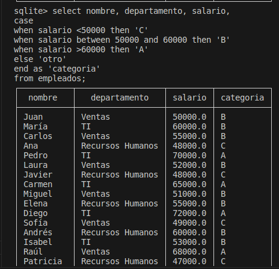
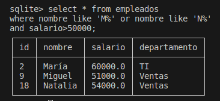

# Trabajo con funciones en BBDD
Objetivo

Practicar la creación y manipulación de una base de datos SQLite3 desde la línea de comandos.
Descripción
## Pasos:
### Paso 1: Creación de la BBDD

Crea con el siguente contenido el fichero empleados-dump.sql.

### Paso 2 Lectura del fichero sql.

```sql
.table
.read empleados_dump.sql
.table
```


### Paso 3: Realización de consultas

Realiza las siguientes consultas, y muestra el resultado obtenido:

* Funciones UPPER y LOWER: Muestra el nombre de todos los empleados en mayúsculas.

```sql
select upper(nombre) as nombre from empleados;
```


* Funciones Numéricas: Calcula el valor absoluto del salario de todos los empleados.

```sql
select abs(salario) as valor_absoluto from empleados;
```


* Funciones de Fecha y Hora: Muestra la fecha actual.

```sql
select current_date as fecha_actual from empleados limit 1;
```


* Funciones de Agregación: Calcula el promedio de salarios de todos los empleados. Convierte la cadena '123' a un valor entero.
```sql
select cast(sum(salario)/count(salario) as integer) as promedio from empleados;
```


* Funciones de Manipulación de Cadenas: Concatena el nombre y el departamento de cada empleado.

```sql
select concat(nombre, ' ', departamento) as nombre_departamento from empleados;
```


* Funciones de Manipulación de Cadenas (CONCAT_WS): Concatena el nombre y el departamento de cada empleado con un guion como separador.

```sql
select concat_ws('-', nombre, departamento) as nombre_departamento from empleados;
```


* Funciones de Control de Flujo (CASE): Categoriza a los empleados según sus salarios.

```sql
select nombre, departamento, salario, 
case 
when salario <50000 then 'C'
when salario between 50000 and 60000 then 'B'
when salario >60000 then 'A'
else 'otro'
end as 'categoria'
from empleados;
```



* Funciones de Agregación (SUM): Calcula la suma total de salarios de todos los empleados.

```sql
select sum(salario) as suma from empleados;
```


* Funciones Numéricas (ROUND): Redondea el salario de todos los empleados a dos decimales.

```sql
select round(salario, 2) as salario_redondeado from empleados;
```


* Funciones de Manipulación de Cadenas (LENGTH): Muestra la longitud de cada nombre de empleado.

```sql
select nombre, length(nombre) as longitud_del_nombre from empleados;
```


* Funciones de Agregación (COUNT): Cuenta el número total de empleados en cada departamento.

```sql
select departamento, count(*) as numero_total 
from empleados
group by departamento;
```


* Funciones de Fecha y Hora (CURRENT_TIME): Muestra la hora actual.

```sql
select current_time from empleados limit 1;
```


* Funciones de Conversión (CAST): Convierte el salario a un valor de punto flotante.

```sql
select cast(salario as decimal) as salario from empleados;
```


* Funciones de Manipulación de Cadenas (SUBSTR): Muestra los primeros tres caracteres de cada nombre de empleado.

```sql
select substr(nombre, 0, 4) as nombre from empleados;
```


### Order By and Like. 

* Empleados en el departamento de 'Ventas' con salarios superiores a 52000.

```sql
select * from empleados where departamento='Ventas' and salario>52000;
```


* Empleados cuyos nombres contienen la letra 'a' y tienen salarios ordenados de manera ascendente.

```sql
select * from empleados 
where nombre like '%a%'
order by salario;
```


* Empleados en el departamento 'Recursos Humanos' con salarios entre 45000 y 55000.

```sql
select * from empleados
where departamento='Recursos Humanos' and
salario between 45000 and 55000;
```


* Empleados con salarios en orden descendente, limitando a los primeros 5 resultados.

```sql
select * from empleados 
order by salario desc limit 5;
```


* Empleados cuyos nombres comienzan con 'M' o 'N' y tienen salarios superiores a 50000.

```sql
select * from empleados
where nombre like 'M%' or nombre like 'N%'
and salario>50000;
```


* Empleados en el departamento 'TI' o 'Ventas' ordenados alfabéticamente por nombre.

```sql
select * from empleados 
where departamento='TI' or departamento='Ventas'
order by nombre;
```


* Empleados con salarios únicos (eliminando duplicados) en orden ascendente.

```sql
select distinct salario from empleados order by salario;
```


* Empleados cuyos nombres terminan con 'o' o 'a' y están en el departamento 'Ventas'.

```sql
select * from empleados 
where departamento='Ventas'
and (nombre like '%a' or nombre like '%o');
```


* Empleados con salarios fuera del rango de 55000 a 70000, ordenados por departamento.

```sql
select * from empleados
where salario not in(55000, 70000)
order by departamento;
```


* Empleados en el departamento 'Recursos Humanos' con nombres que no contienen la letra 'e'.

```sql
select * from empleados
where nombre not like '%e%' 
and departamento='Recursos Humanos';
```

